## 目標
如何包裝 private dependencies，以便能夠將私有套件依賴安全地交付給客戶，同時保護原始碼。

## 使用場景
目前開發過程中，主要透過 private SPM package 或 Cocoapods 來使用其他套件依賴。然而，這些方式無法直接交付給客戶，且無法有效保護原始碼。因此，我們需要將依賴包裝起來，以利交付。

## 解決方案概述
我們有三種可選方案來實現 private dependencies 的包裝：
- **dylib**：動態庫，僅包含編譯後的二進制文件。
- **framework**：動態庫加上資源文件與頭文件的包裝。
- **xcframework**：多平台 framework 的集合包。

以下是三者之間的關係圖示：
```
Dynamic Library (.dylib)
      ↓
Framework (.framework)  =  Dynamic Library + 資源 + 頭文件
      ↓
XCFramework (.xcframework)  =  多平台 Framework 集合包
```

### 選擇考量
| 選項       | 優點                                |
|------------|-------------------------------------|
| **dylib**  | 文件大小小、靈活性高                |
| **framework** | 支援資源文件、具備頭文件 |
| **xcframework** | 多平台支援                       |

---

## 方案詳述

### 選項 1：dylib

#### 流程
1. **建立專案**：開啟 Xcode，選擇“Library”作為項目模板。
   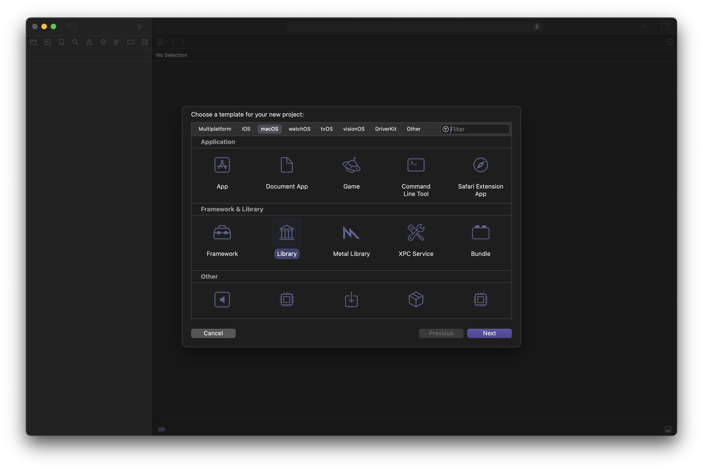

2. **確認 Mach-O 類型**：在 Xcode 中選擇 `Build Settings`，將 `Mach-O Type` 設為 `Dynamic Library`。
   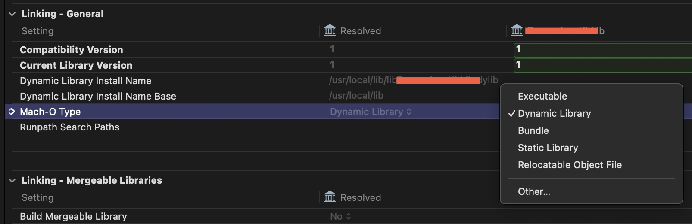

3. **Build 輸出**：完成編譯後，在輸出的資料夾中將生成 `.dylib` 文件和 `.swiftmodule` 資料夾。  
   - 確保目標平台設置為 `generic`，以支持不同架構。或者也可以選擇 `Build for Profiling`，來生成更符合生產環境的文件。
   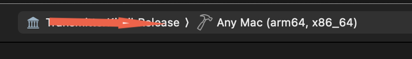

4. **導入 Xcode 專案**：將生成的 `.swiftmodule` 資料夾一同導入專案中，以便讓應用正確連結此動態庫。
   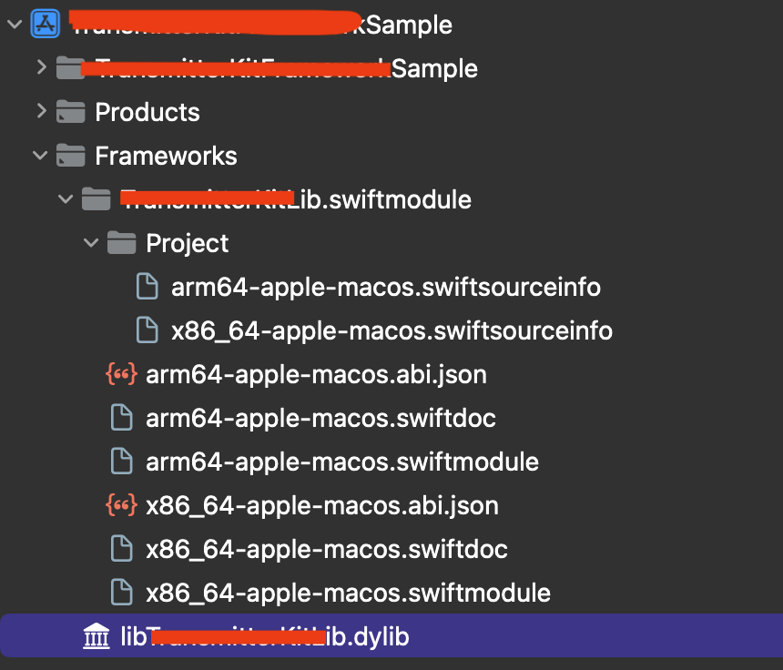

5. **添加至目標（Target）**：在 target 設置頁面中，將 `.dylib` 文件加入並確保 `Embed & Sign` 設置正確。
   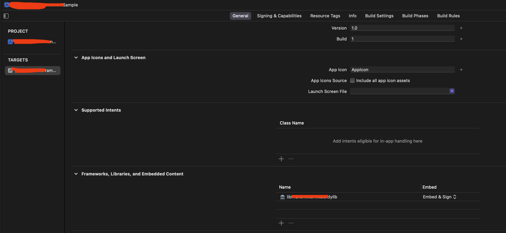
   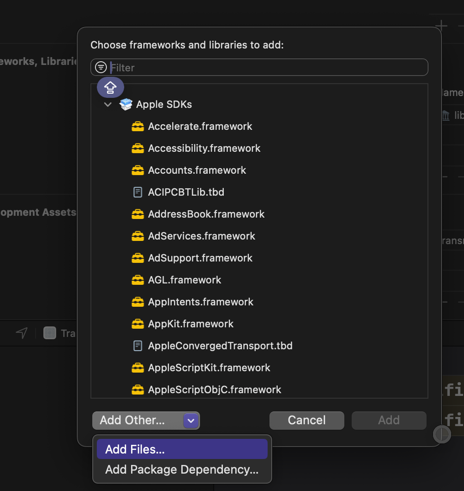
   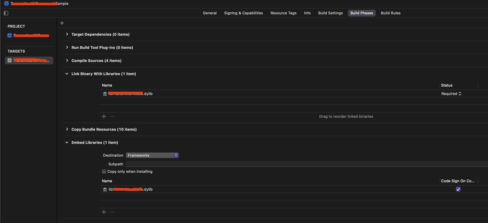

6. **修改 install name**：在最終輸出前，修改 install name，以確保應用程式在運行時能夠正確定位到 dylib 文件。選擇以下任一方式：
   - 使用命令行工具 `install_name_tool`：
     ```bash
     install_name_tool -id @rpath/libSampleLib.dylib /path/to/libSampleLib.dylib
     ```
   - 或者在 Xcode 的 `Build Settings` 中將 `DYLIB_INSTALL_NAME_BASE` 設為 `@rpath`。
   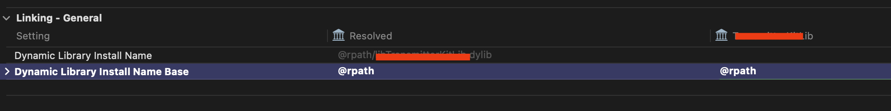

   *關於 `install name` 的重要性*
    修改 `install name` 是確保應用程式運行時能正確加載 `dylib` 文件的關鍵步驟。設置 `install name` 後，動態鏈接器會依此路徑定位 `dylib` 文件。使用 `@rpath` 作為相對路徑可增加靈活性，適應不同目標環境，避免鏈接錯誤。
[install_name_tool: changes the dynamic shared library install names and or adds, changes or deletes the rpaths recorded in a Mach-O binary.](https://www.unix.com/man-page/osx/1/install_name_tool/)

7. **驗證**：
   使用 `otool` 命令檢查 install name 是否設置成功：
   ```bash
   otool -L /path/to/lib/library.dylib
   ```
   成功時應顯示：
   ```
   /path/to/lib/library.dylib (architecture x86_64):
       @rpath/library.dylib (compatibility version 1.0.0, current version 1.0.0)
   /path/to/lib/library.dylib (architecture arm64):
       @rpath/library.dylib (compatibility version 1.0.0, current version 1.0.0)
   ```
[otool: displays specified parts of object files or libraries.](https://www.unix.com/man-page/osx/1/otool)

#### 可選步驟
將不同架構的 dylib 文件整合為一個通用文件，以支援多架構。確保文件名稱正確：
```bash
lipo -create -output universal_library.dylib arm64_library.dylib x86_64_library.dylib
```
確認整合成功：
```bash
lipo -info universal_library.dylib
```
成功時應顯示：
```
Architectures in the fat file: universal_library.dylib are: arm64 x86_64
```
[lipo: Create or operate on a universal file: convert a universal binary to a single architecture file, or vice versa.](https://www.unix.com/man-page/osx/1/lipo/)

#### 參考資料
- [Apple Developer Forums - Thread 736728](https://developer.apple.com/forums/thread/736728)
- [Embedding Nonstandard Code Structures in a Bundle](https://developer.apple.com/documentation/xcode/embedding-nonstandard-code-structures-in-a-bundle)
- [Placing Content in a Bundle](https://developer.apple.com/documentation/bundleresources/placing_content_in_a_bundle)
- [Apple Developer Forums - Thread 725468](https://forums.developer.apple.com/forums/thread/725468)

---

### 選項 2 & 3：framework 和 xcframework

#### 流程
1. **建立專案**：開啟 Xcode，選擇 `Framework` 作為項目類型。
   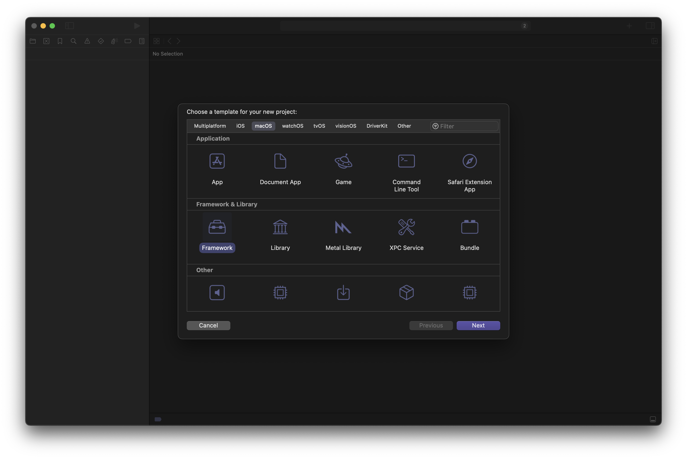

2. **Build 輸出**：完成編譯後，在輸出的資料夾中將包含 `framework` 二進制文件。不同於 `dylib`，`framework` 自帶頭文件（header map），不需要 `.swiftmodule` 文件。
   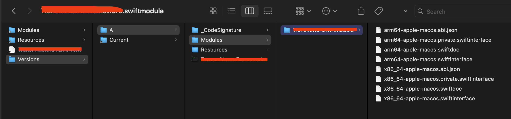

3. **合併多平台 framework**：將不同平台的 `framework` 文件合併為 `xcframework`，以支持跨平台：
   ```bash
   xcodebuild -create-xcframework \
       -framework "${IOS_ARCHIVE_PATH}/Products/Library/Frameworks/${TARGET_NAME}.framework" \
       -framework "${IOS_SIMULATOR_ARCHIVE_PATH}/Products/Library/Frameworks/${TARGET_NAME}.framework" \
       -framework "${MACOS_ARCHIVE_PATH}/Products/Library/Frameworks/${TARGET_NAME}.framework" \
       -output "${OUTPUT_DIR}/${TARGET_NAME}.xcframework"
   ```

#### 示例
以下示例為僅包含 macOS 平台的 framework 打包成的 xcframework。
   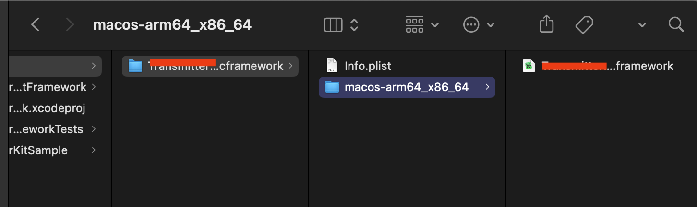

#### 完整構建腳本
將以下腳本放入 Xcode scheme 的 post-actions 中，作為 run script 來自動完成打包流程：
```bash
# 定義輸出目錄
OUTPUT_DIR="${PROJECT_DIR}/build/"

# 移除舊的 build
rm -rf "${OUTPUT_DIR}"

# 建立輸出目錄
mkdir -p "${OUTPUT_DIR}"

# 定義 archive 路徑
IOS_ARCHIVE_PATH="${OUTPUT_DIR}/ios.xcarchive"
IOS_SIMULATOR_ARCHIVE_PATH="${OUTPUT_DIR}/ios-simulator.xcarchive"
MACOS_ARCHIVE_PATH="${OUTPUT_DIR}/macos.xcarchive"

# Archive iOS framework
xcodebuild archive \
  -scheme "${TARGET_NAME}" \
  -destination "generic/platform=iOS" \
  -archivePath "${IOS_ARCHIVE_PATH}" \
  SKIP_INSTALL=NO \
  BUILD_LIBRARY_FOR_DISTRIBUTION=YES

# Archive iOS Simulator framework
xcodebuild archive \
  -scheme "${TARGET_NAME}" \
  -destination "generic/platform=iOS Simulator" \
  -archivePath "${IOS_SIMULATOR_ARCHIVE_PATH}" \
  SKIP_INSTALL=NO \
  BUILD_LIBRARY_FOR_DISTRIBUTION=YES

# Archive macOS framework
xcodebuild archive \
  -scheme "${TARGET_NAME}" \
  -destination "generic/platform=macOS" \
  -archivePath "${MACOS_ARCHIVE_PATH}" \
  SKIP_INSTALL=NO \
  BUILD_LIBRARY_FOR_DISTRIBUTION=YES

# Create XCFramework
xcodebuild -create-xcframework \
  -framework "${IOS_ARCHIVE_PATH}/Products/Library/Frameworks/${TARGET_NAME}.framework" \
  -framework "${IOS_SIMULATOR_ARCHIVE_PATH}/Products/Library/Frameworks/${TARGET_NAME}.framework" \
  -framework "${MACOS_ARCHIVE_PATH}/Products/Library/Frameworks/${TARGET_NAME}.framework" \
  -output "${OUTPUT_DIR}/${TARGET_NAME}.xcframework"

# 清理 archive 檔案
rm -rf "${IOS_ARCHIVE_PATH}"
rm -rf "${IOS_SIMULATOR_ARCHIVE_PATH}"
rm -rf "${MACOS_ARCHIVE_PATH}"
```

#### 參考資料
- [Binary Frameworks in Swift](https://developer.apple.com/videos/play/wwdc2019/416/)
- [Creating a Multiplatform Binary Framework Bundle](https://developer.apple.com/documentation/xcode/creating-a-multi-platform-binary-framework-bundle)
--- 
